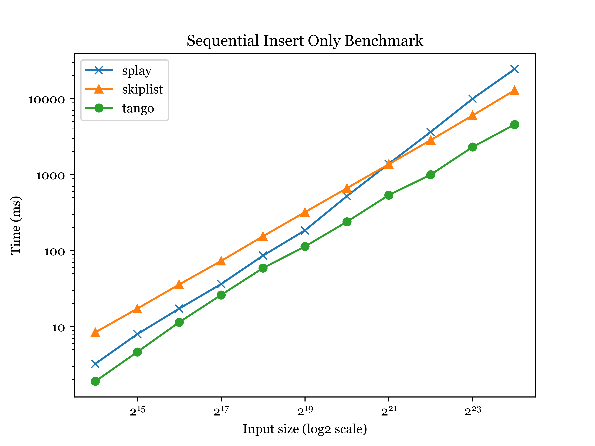

# Benchmarks for Splay Tree, Skip List & Tango Tree  

---

## 1 • Subset Search Benchmark  
_(hot-subset size vs. total search time)_

| Parameter | Value |
|-----------|-------|
| Inserted keys | `N = 10 000 000` |
| Searches      | `N` searches drawn only from a hot subset |
| Subset size   | `p%` of `N`, `p ∈ {0.0001 … 75}` |

---

## 2 • Sequential Insert-Only  

Insert keys `1…N` in order (no search/delete).  
Shows build-cost on a degenerate increasing sequence.

---

## 3 • Random Insert-Only  

Same as (2) but keys arrive in random order.

---

## 4 • Random Deletion  

Start with random inserts, then delete `N` random keys.

---

## 5 • Sequential Deletion  

Insert sequentially, delete sequentially (`1…N`).

---

## 6 • Random Search  

After random build, perform `N` uniform-random searches.

---

## 7 • Sequential Search  

After sequential build, search keys in ascending order once.

---

## 8 • Random Search + Delete  

Mixed workload: 50 % random searches, 50 % random deletes.

---

## 9 • Sequential Search + Delete  

Search keys `1…N`, then delete the same sequence.

